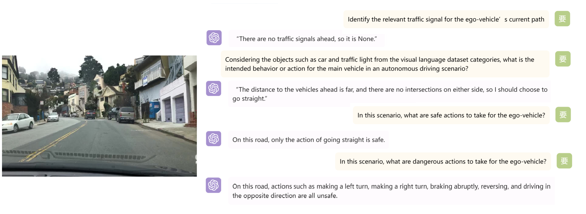

# AD Via LLaVA
## Demo


## Dataset Detail
We chose 130 images from [BDD100K](https://doc.bdd100k.com/download.html). We selected 124 images that meet the criteria from among 18 weather-related tags. 
|    Weather    |    Time   | Number |
|:-------------:|:---------:|:------:|
|               | dawn/dusk |    8   |
|     clear     |  daytime  |    8   |
|               |   night   |    8   |
|               | dawn/dusk |    7   |
| partly cloudy |  daytime  |    8   |
|               |   night   |    5   |
|               | dawn/dusk |    7   |
|    overcast   |  daytime  |    8   |
|               |   night   |    8   |
|               | dawn/dusk |    7   |
|     rainy     |  daytime  |    8   |
|               |   night   |    8   |
|               | dawn/dusk |    8   |
|     snowy     |  daytime  |    7   |
|               |   night   |    8   |
|               | dawn/dusk |    1   |
|     foggy     |  daytime  |    5   |
|               |   night   |    7   |

We simplified [DriveLM](https://github.com/OpenDriveLab/DriveLM)  and selected four QAs that we thought were worth exploring. In order to achieve better results, we used ChatGPT to improve the question based on LLaVA's pre-training and alignment data, making the model achieve about 30% accuracy among the questions we set.


## Get started

### Installation
Please follow [LLaVA](https://github.com/haotian-liu/LLaVA) to configurate the environment, LLaMA(or Vincuna) weights.

### Generate LLaVA responses

You need to modify the model path in [sh](./exc.sh).
```
sh exc.sh 
```
OR

```Shell
python model_vqa.py \
    --model-path ./checkpoints/LLaVA-13B-v0 \
    --question-file \
    playground/data/coco2014_val_qa_eval/qa90_questions.jsonl \
    --image-folder \
    /path/to/coco2014_val \
    --answers-file \
    /path/to/answer-file-our.jsonl
```

### Evaluate the generated responses.  
In our case, [`124_chosen-ref.jsonl`](./AD/124_chosen_ref.jsonl) is the answer which was annotated by human. And our orginal annotation excel file is on [google drive](https://drive.google.com/file/d/1EZUdFEs4crIMfjB7z1xpGflNNEN6OIgz/view?usp=sharing).

Modify the path in [sh](./eva.sh). 

```Shell
sh eva.sh 
```
OR

```Shell
OPENAI_API_KEY="sk-***********************************" python llava/eval/eval_gpt_review_visual.py \
    --question playground/data/coco2014_val_qa_eval/qa90_questions.jsonl \
    --context llava/eval/table/caps_boxes_coco2014_val_80.jsonl \
    --answer-list \
    /path/to/answer-file-ref.jsonl \
    /path/to/answer-file-our.jsonl \
    --rule llava/eval/table/rule.json \
    --output /path/to/review.json
```


### Get score of the generated responses

Open [Score_tuple](./scripts/AD/Score_tuple.py) and modify the path. Then run it.


### Summarize the evaluation results

Modify the path in summary.sh[summary](./summary.sh). 

```Shell
sh summary.sh 
```

## Teammembers
- [Ruoyu Chen](https://ruoyuchen10.github.io/)
- [Zirui Song](https://github.com/ZiruiSongBest)
- [Zhenhao Chen](https://zhenhaochenofficial.github.io/)
- [Dayan Guan*](https://dayan-guan.github.io/)
- Helin Wang
- YangJing Pu
- Zihui Cui
- Jiangyu Shan

We would like to express our gratitude to the students(Yuehuan Wang, Yuxiao Huang, Zedong Zhao, Zheng Sun,Yuan Huang, Zhe Fu) who participated in data annotation.
## Acknowledgement

- [Vicuna](https://github.com/lm-sys/FastChat): the codebase we built upon, and our base model Vicuna-13B that has the amazing language capabilities!

## Related Projects

- [LLaVA](https://github.com/haotian-liu/LLaVA)
- [LLaVA-Med: Training a Large Language-and-Vision Assistant for Biomedicine in One Day](https://github.com/microsoft/LLaVA-Med)
- [Drive on Language: Unlocking the future where autonomous driving meets the unlimited potential of language](https://github.com/OpenDriveLab/DriveLM)
- [DriveGPT4:Interpretable End-to-end Autonomous Driving via Large Language Model](https://tonyxuqaq.github.io/projects/DriveGPT4)
- [LINGO-1: Exploring Natural Language for Autonomous Driving](https://wayve.ai/thinking/lingo-natural-language-autonomous-driving/)

